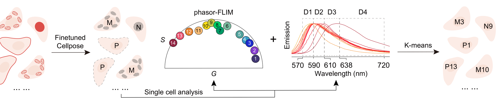
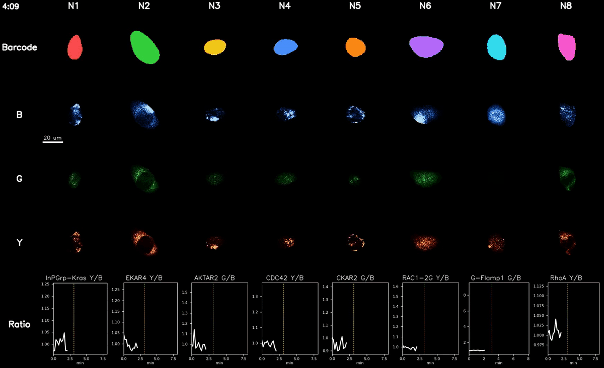
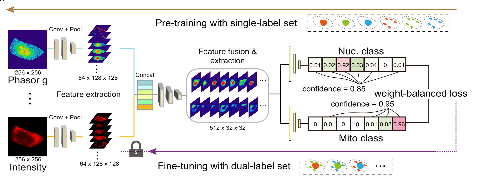

# 🔬 SLIC — Spectral-Lifetime Indexing of Cells

[](https://doi.org/10.5281/zenodo.22228957)
[](Napari_plugin/LICENSE)

**Many barcoded cell populations in one dish, each read out separately.**



Cells carry **barcodes**: fluorophore combinations that differ in fluorescence
lifetime and emission spectrum. One FLIM acquisition gives every pixel a
photon-arrival histogram in four spectral channels. Averaged over a segmented
cell that becomes five numbers — phasor coordinates *G* and *S* plus three
spectral intensity ratios. Cells sharing a barcode land in the same place in
that 5-D space, so clustering assigns each cell its barcode. A biosensor
channel is then read per class, giving one measurement per barcoded population
from a single mixed dish.

### 🌐 Try it in a browser — nothing to install

**<https://baoyi-a.github.io/nacha-demo/>** runs the plugin on the demo dataset
in a browser, with no local setup. The page starts a cloud machine on demand,
optionally with a GPU for the segmentation steps, and shuts it down when idle.
It re-installs from this repository's `main` on every cold start, so it runs the
published code rather than a snapshot.

## What is in here

Two independent tools, each with its own README, its own environment, and no
code shared between them.

| | |
|---|---|
| 🧩 **[`Napari_plugin/`](Napari_plugin/README.md)** | **SLIC**, the napari plugin — also known as **NaCha**, which is its final widget and the name the hosted demo goes by. Seven widgets take you from a raw `.ptu` to one biosensor readout per barcode. Installs as `bc-flim-spectra`. |
| 🧠 **[`LUMINA_classification/`](LUMINA_classification/README.md)** | **LUMINA** — the dual-anchor classifier, for cells carrying two barcodes at once. |
| 🤖 [`.claude/skills/`](.claude/skills/) | One agent skill per tool, so a coding assistant can install and drive either of them. See [below](#-slic-works-with-an-ai-assistant). |

Each tagged release is archived on Zenodo; the DOI above always resolves to the
most recent version, and the version DOI on the Zenodo record cites the exact
version described in the manuscript.

---

## 1. 🧩 Napari Plugin — Single-Anchor Barcode Analysis

The SLIC napari plugin runs the full workflow, from `.ptu` ingestion through
segmentation, classification and tracking to alignment and visualization. It is
distributed as the Python package `bc-flim-spectra` and appears in napari under
that name; *NaCha* is the label of its final widget.

**Seven widgets**, listed under `Plugins → bc-flim-spectra`. Each has a blue
**Next ▶** button that opens the following one, so the workflow chains without
returning to the menu.

- 📥 **PTU Reader** — import and decode FLIM `.ptu` files.
- 🔬 **Barcode Seg (Cellpose)** — N / P segmentation on the barcode intensity image, with online single- or multi-folder fine-tuning.
- 🌀 **Calculate FLIM-S** — lifetime / phasor computation.
- 🧩 **Seeded K-Means** — semi-supervised barcode classifier (Basu et al. 2002 — seeds initialise centroids, then K-Means refines). Also ships K-Means++, MiniBatchKMeans, Gaussian Mixture and Spectral as alternatives; per-class outlier flagging; save / load of class distribution overlays.
- 🟡 **Biosensor Seg (Cellpose)** — dual-input segmentation on the confocal biosensor stack, using the barcode classification mask as an auxiliary channel.
- 🎬 **B&P Tracker** — barcode / object tracking (built on Track-Anything / XMem).
- 📈 **NaCha** — final alignment and per-class signal readout / visualization.



*Sixteen barcoded populations in one dish, read out one at a time: each column
is a barcode, its biosensor, the three confocal channels, and that population's
own response to the stimulus. A full step-by-step
[instruction video](https://zenodo.org/records/17045806) is on Zenodo.*

➡️ **Installation and full usage: [`Napari_plugin/README`](Napari_plugin/README.md)**

---

## 2. 🧠 LUMINA — Dual-Anchor Barcode Classification Network



**LUMINA** classifies cells carrying **two** barcodes at once — one fluorophore
on a nuclear anchor, one on a mitochondrial anchor. Averaging a whole cell into
five numbers cannot separate two fluorophores sitting in two organelles, so
LUMINA keeps the pixels: per segmented cell it builds a six-plane stack (the
per-pixel phasor *G* and *S*, three spectral intensity ratios, and the
intensity), gives each plane its own convolutional stem, fuses them in a shared
trunk, and ends in **two independent heads** under a class-balanced loss. One
forward pass reads both anchors. Training is two-stage: pre-train on
single-anchor data, then fine-tune on dual-anchor data.

- 🧹 `Data_Prep.py` — preprocess raw data.
- 🏋️ `Train_LUMINA.py` — train the LUMINA model.
- 🔍 `Test_LUMINA.py` — inference on new data.
- 🔥 `Visualize_heatmap.py` — visualize results.

➡️ **Installation and full usage: [`LUMINA_classification/README`](LUMINA_classification/README.md)**

---

## 🖥 Environment
- Python >= 3.8 (tested on Python 3.10)
- Operating system:
  - Tested on: Windows 11
  - Expected to work on: Windows 10/11, Linux (Ubuntu 20.04)
- GPU: optional (CUDA-enabled GPU recommended for acceleration)

**Typical installation time:** ~20–60 minutes depending on whether PyTorch/CUDA
wheels need to be downloaded and the network speed.

---

## ⏱ Expected runtime (representative)

### 🧩 Napari Plugin (interactive)
- Typical processing time per dataset: ~10–15 minutes on a CUDA GPU, most of it
  spent looking at masks rather than waiting.
- Tracking step: ~5 minutes (included above).
- **Check the "Compute:" line in the segmentation panel first.** The default
  PyTorch package has no GPU support, and on CPU segmentation of one
  2048 × 2048 field takes tens of minutes instead of seconds. Nothing fails —
  it is just slow, and the header is the only place that says so.
- Runtime otherwise depends on dataset size, number of cells, and hardware.

### 🧠 LUMINA
- Inference on a single sample/image: ~1 second
- Including preprocessing (e.g., segmentation / data extraction): typically 3 minutes
- Model training (if performed) can take longer and depends on dataset size and GPU.

---

## 🤖 SLIC works with an AI assistant

The repository carries its documentation in a form coding assistants read, to
the [agents.md](https://agents.md) and [Agent Skills](https://agentskills.io)
conventions used by Claude Code, Codex, Cursor and Copilot. Pointed at this
repository, an assistant can install either tool, explain a parameter, and read
a sample folder to report which steps have run and whether they look right.

### ✅ Validation — an assistant reproduced our curated result

We gave **Claude Code** nothing but the address of this repository and asked it
to install SLIC and process one dataset. Working only from the files here it
built a fresh environment, installed the plugin, and ran all seven steps on a
real 1.5 GB acquisition — from `.ptu` decoding through to one signal curve per
barcode.

Then the harder question: does a fully automatic run agree with the version a
human checked and corrected?

| Against our manual curation | |
|---|---|
| 🧩 **Barcode identity** | **271 of 271 cells got the same barcode. None wrong.** Shuffling the labels drops it to 21–28 %, so the agreement is real. |
| 🔬 **Segmentation** | F1 0.83 (nuclei) and 0.87 (cytoplasm) at IoU ≥ 0.5; 0 splits, 1 merge |
| 📋 **End to end** | 77 % of curated cells got the correct barcode, 5 % were declined as outliers, 18 % were never segmented, **0 % got a wrong one** |

Wherever it finds a cell, it calls the barcode exactly as we did. What a fully
automatic run costs is coverage, not correctness — the stock nucleus model finds
about three quarters of the nuclei our fine-tuned-and-curated reference has.
Fine-tuning on your own cells is a widget in the plugin, and it closes that gap.

Our run took an afternoon on **Claude Opus**, most of it waiting on the GPU,
and a few million tokens — tens of dollars of model usage.
*One field of one acquisition — a reproduction check, not a benchmark.*

### 🔍 "Where am I in the workflow?"

`Napari_plugin/scripts/workflow_status.py` reads a sample folder and reports
which steps have run, quality checks on what they produced, and what is left.
Read-only; no napari, no GPU.

```bash
python Napari_plugin/scripts/workflow_status.py <sample folder>
```

```
  [   done] 3 Calculate FLIM-S   rows=834, fovs=1, localisations={'N': 418, 'P': 416}
  [   done] 4 Seeded K-Means     clustered=418, classified=373, declined=45, classes=10
  [not run] 5 Biosensor Seg
  [  check] registration         best=90 CW, coverage=0.966, purity=0.998

  PASS  S stays under the semicircle apex (0.5) — max S = 0.4997
  PASS  lifetimes are physical (0.1-10 ns) — 1.24-3.80 ns
  PASS  barcode classes land on biosensor cells — 96.6% of cells, purity 99.8%

  Next
  - Seeded K-Means: 416 row(s) were never clustered — it runs one localisation
    at a time and only ['N'] has been done.
  - Steps 5-7 (biosensor) have not run. They need the confocal B/G/Y stacks.
```

It checks the decay stacks, the masks, the phasor coordinates against the
universal semicircle, the lifetimes, the declined fraction, the class sizes, and
the registration — for which it tries all four rotations and reports coverage
*and* purity, since coverage alone cannot tell a correct alignment from a wrong
one. `--json` for scripting; exit status 1 on a failed check, so it gates too.

### 📚 What the assistant reads

| File | Contents |
|---|---|
| [`AGENTS.md`](AGENTS.md) | Repository layout, installation, the three-environment design, the headless testing pattern, and the conventions the code follows. Claude Code picks it up through the one-line `CLAUDE.md`. |
| [`.claude/skills/slic-napari/`](.claude/skills/slic-napari/) | The plugin: seven steps control by control, how to read each output, the failure modes with the check that identifies each, and installation notes. |
| [`.claude/skills/lumina-network/`](.claude/skills/lumina-network/) | LUMINA: the scripts, the data layout they expect, the training recipe, how to read the confidence outputs, and how to adapt a trained checkpoint to a new cell line. |

Parameter descriptions in the skills are pulled from the widget tooltips and
argument parsers in the source, so the documentation and the interfaces cannot
drift apart.

## 📜 License
BSD 2-Clause License. See [`Napari_plugin/LICENSE`](Napari_plugin/LICENSE) for the full text.

---

## 📝 Notes

- These tools are under active development.
- The manuscript describing the methods has been submitted but not yet published. The DOI will be provided once it becomes available. The schematics above are figure panels from that manuscript.
- An [instruction video](https://zenodo.org/records/17045806) is available, providing a step-by-step guide on how to use the Napari plugin.
- The [Dual-Anchor dataset](https://zenodo.org/records/17036213), used for training the LUMINA network, is also provided.
- A [demo dataset](https://zenodo.org/records/16940026) is included for testing the Napari plugin functionalities.
- The [original version of all software code](https://zenodo.org/records/17018436) has been archived as well.
